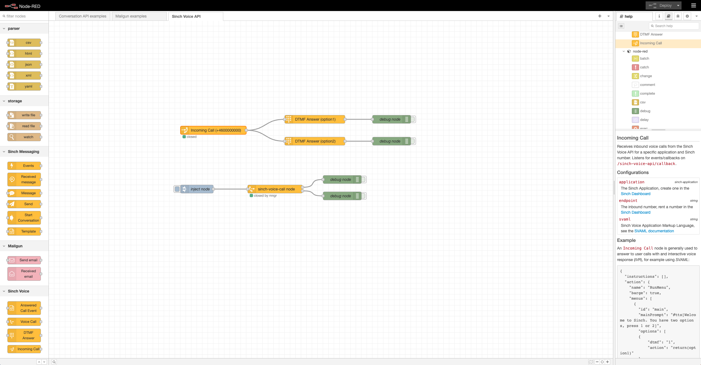

# @sinch/node-red-voice-api

A package of nodes for [Node-RED](https://nodered.org) which allows you to connect, initiate and receive voice calls through the Sinch Voice API. For more information about the Sinch Voice API and how to get started, see the [documentation](https://developers.sinch.com/docs/voice/getting-started/).



## Installation

The first step is to install [Node-RED](https://nodered.org/docs/getting-started/local).

```
$ sudo npm install -g node-red
```

> Compatible with Node-Red version 3.x.x and later

The second step is to install the package. You can either install it directly using the Palette Manager. Instructions can be found here: [Node-RED](https://nodered.org/docs/user-guide/runtime/adding-nodes).

Or install manually using npm:

Navigate to the Node-RED installation and install the package:

```
$ cd ~/.node-red
$ npm install @sinch/node-red-voice-api
```

Run Node-RED locally: 
```
$ node-red
```

This will start a server for Node-RED on [http://127.0.0.1:1880/](http://127.0.0.1:1880/).

If the installation of the node package was successful, the Sinch Voice API nodes should be available in the node palette to the left, under the category "Sinch Voice". 

## Get started
After you've installed Node-RED and the @sinch/node-red-voice-api package you can start building your flow. To get you started we provide an example [flows.json](docs/examples/flow.json) containing the essentials for initiating and receiving voice calls. To import the flows.json file, open Node-RED in the brower and select the hamburger menu in the top right corner. Choose "Import" and press "select a file to import". The flow file will then be imported on a tab called "Example flow". 

The flow.json contains two separate flow examples. For each of the flows there exists a comment node containing additional information about the configuration required to test it out.

### Testing
If you're running Node-RED locally on localhost and want to test receiving voice calls and events, we recommend using a tool like [Ngrok](https://ngrok.com/). This tool allow you to expose your localhost to the internet and makes it possible to route callback events to Node-RED. This is also a useful for testing the native Http-in node provided by Node-RED.

## More about the nodes
This package contains the following four nodes:

### Incoming Call node
Handles and routes inbound voice calls from the Sinch Voice API for a specific application and Sinch number.

In order to receive calls from the Sinch Voice APi, you need to configure a Callback URL on the voice application in the [Sinch dashboard](https://dashboard.sinch.com/voice/apps). The path should be: <i>&lt;node-red-path&gt;/sinch-voice-api/callback</i>.

### Voice Call node
Initiates an outbound voice call using the Sinch Voice API.

In order to initiate calls from the Sinch Voice APi, you need to configure a Callback URL on the voice application in the [Sinch dashboard](https://dashboard.sinch.com/voice/apps). The path should be: <i>&lt;node-red-path&gt;/sinch-voice-api/callback</i>.

### DTMF Answer
Captures the DTMF (Dual Tone Multi Frequency) keypad (0-9, * and #) input from the user response.

### Answered Call Event (ACE)
Stores a SVAML for a call (inbound or outbound) in case of an ACE (Answered Call Event).

## Contributing
See, [CONTRIBUTING.md](CONTRIBUTING.md).

## Copyright and license
Copyright Sinch AB, https://sinch.com under the [Apache 2.0 license](LICENSE).